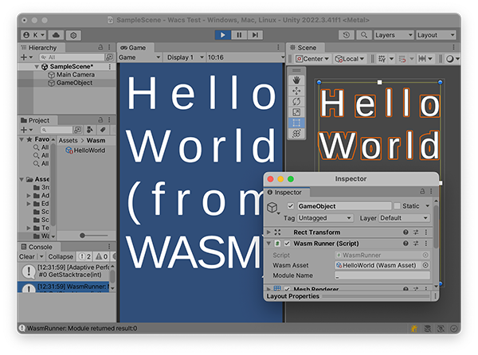

# WACS (C# WebAssembly Interpreter)
[](https://www.nuget.org/packages/WACS/)
 
## Overview

**WACS** is a pure C# WebAssembly Interpreter for running WASM modules in .NET environments, including AOT environments like Unity's IL2CPP.
The architecture is my literal interpretation of the WebAssembly spec, so it should be conceptually similar to the OCaml reference interpreter.
The chapters and sections from the spec are commented throughout the source code and should serve as a good reference for others. 



## Table of Contents

- [Features](#features)
- [Getting Started](#getting-started)
- [Installation](#installation)
- [Usage](#usage)
- [Integration with Unity](#integration-with-unity)
- [Interop Bindings](#interop-bindings)
- [Customization](#customization)
- [Roadmap](#roadmap)
- [License](#license)

## Features

- **Pure C# Implementation**: Written in C# 9.0/.NET Standard 2.1. (No unsafe code)
- **No Complex Dependencies**: Uses [FluentValidation](https://github.com/FluentValidation/FluentValidation) as its only dependency.
- **Unity Compatibility**: Compatible with **Unity 2021.3+** including AOT/IL2CPP modes for iOS.
- **Full WebAssembly MVP Compliance**: Passes the  [WebAssembly spec test suite](https://github.com/WebAssembly/spec/tree/main/test/core).
- **Magical Interop**: Host bindings are validated with reflection, no boilerplate code required.
- **WASI:** Wacs.WASIp1 provides a [wasi\_snapshot\_preview1](https://github.com/WebAssembly/WASI/blob/main/legacy/preview1/docs.md) implementation.

## Getting Started

### Installation

The easiest way to use WACS is to add the package from NuGet

```bash
dotnet add package WACS
dotnet add package WACS.WASIp1
````

If you prefer to build WACS from source, you can clone the repo and build it with the .NET SDK:

```bash
git clone https://github.com/kelnishi/WACS.git
cd WACS
dotnet build
```

## Usage

Basic usage example, how to load and run a WebAssembly module:

```csharp
using System;
using System.IO;
using Wacs.Core;
using Wacs.Core.Runtime;

//Create a runtime
var runtime = new WasmRuntime();

//Bind a host function
//  This can be any regular C# delegate.
//  The type here will be validated against module imports.
runtime.BindHostFunction<Action<char>>(("env", "sayc"), c =>
{
    System.Console.Write(c);
});

//Load a module from a binary file
using var fileStream = new FileStream("HelloWorld.wasm", FileMode.Open);
var module = BinaryModuleParser.ParseWasm(fileStream);

//Instantiate the module
var modInst = runtime.InstantiateModule(module);

//Register the module to add its exported functions to the export table
runtime.RegisterModule("hello", modInst);

//Get the module's exported function
if (runtime.TryGetExportedFunction(("hello", "main"), out var mainAddr))
{
    //For wasm functions you can expect return types as Wacs.Core.Runtime.Value
    //  Value has implicit conversion to many useful primitive types
    var mainInvoker = runtime.CreateInvoker<Func<Value>>(mainAddr);
    
    //Call the wasm function and get the result
    //  Implicit conversion from Value to int
    int result = mainInvoker();
    
    System.Console.Error.WriteLine($"hello.main() => {result}");
}
```

## Integration with Unity

WACS works out-of-the-box with Unity, even in AOT IL2CPP modes for iOS. Simply add the Wacs.Core and FluentValidation assemblies to your project. See the example repo for details.

## Interop Bindings

WACS simplifies host function bindings, allowing you to easily call .NET functions from WebAssembly modules.
This allows seamless communication between your host environment and WebAssembly without boilerplate code.
Similarly, calling into wasm code is done by generating a typed delegate.

Example from WASIp1:

```csharp
//Alias your types for readability
using ptr = System.Int32;

//WACS can bit-convert types like Enums and explicit layout structs
[WasmType(nameof(ValType.I32))]
public enum ErrNo : ushort
{
    Success = 0,
    ...
}

//Supply the delegate definition when binding
//  ExecContext is an optional first parameter for Memory and Stack manipulation
runtime.BindHostFunction<Func<ExecContext,ptr,ptr,ErrNo>>(
   (module, "args_get"), ArgsGet);

// WASIp1's args_get
public ErrNo ArgsGet(ExecContext ctx, ptr argvPtr, ptr argvBufPtr)
{
    var mem = ctx.DefaultMemory;
            
    foreach (string arg in _config.Arguments)
    {
        // Copy argument string to argvBufPtr.
        int strLen = mem.WriteUtf8String((uint)argvBufPtr, arg, true);
                
        // Write pointer to argument in argvPtr.
        mem.WriteInt32(argvPtr, argvBufPtr);

        // Update offsets.
        argvBufPtr += strLen;
        argvPtr += sizeof(ptr);
    }

    return ErrNo.Success;
}
```

## Customization

If you'd like to customize the wasm runtime environment, I recommend downloading the full source for examples.

The `Wacs.WASIp1` implementation is a good starting point for how to set up your own library of bindings.
It also contains examples of more advanced usage like binding multiple return values and full operand stack access.

The `Spec.Test` project runs the wasm spec test suite. This also contains examples for binding other runtime environment
objects like Tables, Memories, and Variables.

Custom Instruction implementations can be patched in by replacing or inheriting from `SpecFactory`.

## Roadmap

The current TODO list includes:

- **ExecAsync:** Thread scheduling and advanced gas metering.
- **Wasm Garbage Collection**: Support  wasm-gc and heaptypes.
- **Text Format Parsing**: Add support for WebAssembly text format.
- **WASI p1 Test Suite**: Validate WASIp1 with the test suite for improved standard compliance.
- **WASI p2 and Component Model**: Implement the component model proposal.
- **SIMD Intrinsics**: Add hardware-accelerated SIMD (software implementation included in Wacs.Core).
- **Unity Bindings for SDL**: Implement SDL2 with Unity bindings.
- **Instantiation-time Optimization**: Improvements like superinstruction threading and selective inlining for better performance.
- **JavaScript Proxy Bindings**: Maybe support common JS env functions.
- **Phase 5 WASM Extensions**: Upcoming features as WebAssembly evolves.

## Sponsorship & Collaboration

I built and maintain WACS as a solo developer. 

If you find it useful, please consider supporting me through sponsorship or work opportunities. 
Your support can help me continue improving WACS to make WebAssembly accessible for everyone. 

[Sponsor me](https://github.com/sponsors/kelnishi) or [connect with me on LinkedIn](https://www.linkedin.com/in/kelnishi) if you're interested in collaborating!

## License

WACS is distributed under the [Apache 2.0 License](./LICENSE). This permissive license allows you to use WACS freely in both open and closed source projects.

---

I would love for you to get involved and contribute to WACS! Whether it's bug fixes, new features, or improvements to documentation, your help can make WACS better for everyone.

**Star this project on GitHub if you find WACS helpful!** ⭐

