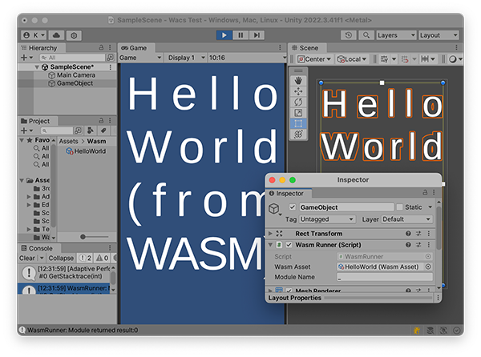

# WACS (C# WebAssembly Interpreter)
 

[](LICENSE)
[](https://www.nuget.org/packages/WACS)
[](https://www.nuget.org/packages/WACS.WASIp1)
[](https://www.nuget.org/packages/WACS.Transpiler)
[](https://www.nuget.org/packages/WACS)

## Overview
Latest changes: [0.8.1](https://github.com/kelnishi/WACS/tree/main/CHANGELOG.md)

**WACS** is a pure C# WebAssembly Interpreter for running WASM modules in .NET environments, including Godot and AOT environments like Unity's IL2CPP.

WACS supports the latest standardized webassembly feature extensions including **Garbage Collection** and **JSPI**-like async execution. 



## Table of Contents

- [Features](#features)
- [WebAssembly Feature Extensions](#webassembly-feature-extensions)
- [Getting Started](#getting-started)
- [Installation](#installation)
- [Usage](#usage)
- [Integration with Unity](#integration-with-unity)
- [Integration with Godot](#integration-with-godot)
- [Interop Bindings](#interop-bindings)
- [Customization](#customization)
- [Performance](#performance)
- [Roadmap](#roadmap)
- [License](#license)

## Features

- **Unity Compatibility**: Compatible with **Unity 2021.3+** including AOT/IL2CPP modes for iOS.
- **Godot Compatibility**: Compatible with **Godot Engine - [.NET](https://docs.godotengine.org/en/stable/tutorials/scripting/c_sharp/c_sharp_basics.html)**. 
- **Pure C# Implementation**: Written in C# 9.0/.NET Standard 2.1. (No unsafe code)
- **No Complex Dependencies**: Uses [FluentValidation](https://github.com/FluentValidation/FluentValidation) and [Microsoft.Extensions.ObjectPool](https://www.nuget.org/packages/Microsoft.Extensions.ObjectPool) as its only dependencies.
- **WebAssembly 3.0 Spec Compliance**: Passes the [WebAssembly 3.0](https://webassembly.github.io/spec/versions/core/WebAssembly-3.0-draft.pdf) spec [test suite](https://github.com/WebAssembly/spec/tree/wasm-3.0).
- **Magical Interop**: Host bindings are validated with reflection, no boilerplate code required.
- **Async Tasks**: [JSPI](https://github.com/WebAssembly/js-promise-integration)-like non-blocking calls for async functions.
- **WASI:** Wacs.WASIp1 provides a [wasi\_snapshot\_preview1](https://github.com/WebAssembly/WASI/blob/main/legacy/preview1/docs.md) implementation.

**WACS is for _mobile games_**. 

Because WebAssembly is memory-safe and can be ahead-of-time validated, WACS makes it possible to build safe, verifiable
UGC, DLC, or plugin systems that include executable logic.

## WebAssembly Feature Extensions
WACS is based on the [WebAssembly Core 3 draft spec](https://webassembly.github.io/spec/versions/core/WebAssembly-3.0-draft.pdf) and passes the associated [test suite](https://github.com/WebAssembly/spec/tree/wasm-3.0).

Support for all standardized extensions is listed below.

Harnessed results from [wasm-feature-detect](https://github.com/GoogleChromeLabs/wasm-feature-detect) as compares to [other runtimes](https://webassembly.org/features/):

|Proposal |Features|    |
|------|-------|----|
|Phase 5|
|[JavaScript BigInt to WebAssembly i64 integration](https://github.com/WebAssembly/JS-BigInt-integration)||<span title="Browser idiom, but conceptually supported">✳️</span>|
|[Bulk memory operations](https://github.com/webassembly/bulk-memory-operations)||✅|
|[Extended Constant Expressions](https://github.com/WebAssembly/extended-const)|extended_const|✅|
|[Garbage collection](https://github.com/WebAssembly/gc)|gc|✅|
|[Multiple memories](https://github.com/WebAssembly/multi-memory)|multi-memory|✅|
|[Multi-value](https://github.com/WebAssembly/multi-value)|multi_value|✅|
|[Import/Export of Mutable Globals](https://github.com/WebAssembly/mutable-global)||✅|
|[Reference Types](https://github.com/WebAssembly/reference-types)||✅|
|[Relaxed SIMD](https://github.com/webassembly/relaxed-simd)|relaxed_simd|✅|
|[Non-trapping float-to-int conversions](https://github.com/WebAssembly/nontrapping-float-to-int-conversions)||✅|
|[Sign-extension operators](https://github.com/WebAssembly/sign-extension-ops)||✅|
|[Fixed-width SIMD](https://github.com/webassembly/simd)||✅|
|[Tail call](https://github.com/webassembly/tail-call)|tail_call|✅|
|[Typed Function References](https://github.com/WebAssembly/function-references)|function-references|✅|
|Phase 4|
|[Exception handling](https://github.com/WebAssembly/exception-handling)|exceptions|✅|
|[JS String Builtins](https://github.com/WebAssembly/js-string-builtins)||❌|
|[Memory64](https://github.com/WebAssembly/memory64)|memory64|✅|
|[Threads](https://github.com/webassembly/threads)|threads|❌|
|Phase 3|
|[JS Promise Integration](https://github.com/WebAssembly/js-promise-integration)|jspi|<span title="Browser idiom, but conceptually supported">✳️</span>|
|[Type Reflection for WebAssembly JavaScript API](https://github.com/WebAssembly/js-types)|type-reflection|<span title="Browser idioms, not directly supported">🌐</span>|
||
|[Legacy Exception Handling]( https://github.com/WebAssembly/exception-handling)|exceptions|❌|
|[Streaming Compilation](https://webassembly.github.io/spec/web-api/index.html#streaming-modules)|streaming_compilation|<span title="Browser idioms, not directly supported">🌐</span>|

###### This table was generated with the Feature.Detect test harness.

## Getting Started

### Installation

The easiest way to use WACS is to add the package from NuGet

```bash
dotnet add package WACS
dotnet add package WACS.WASIp1
````

### AOT Transpiler

`WACS.Transpiler` is a companion package that ahead-of-time transpiles a
`.wasm` module into a .NET assembly. Installs as a [dotnet global
tool](https://learn.microsoft.com/en-us/dotnet/core/tools/global-tools),
backed by the same WACS runtime:

```bash
dotnet tool install -g WACS.Transpiler
wasm-transpile -i module.wasm -o module.dll
```

For WASI preview1 modules (CoreMark, anything built against `wasi-libc`):

```bash
wasm-transpile -i coremark.wasm -o coremark.dll --wasi --entry-point _start --run
```

`--wasi` binds `WACS.WASIp1` to the runtime, forwards all
`wasi_snapshot_preview1` imports, shares memory with the interpreter
bindings, and invokes the entry-point export in-process. For custom
host imports (`env.sayc`, game bindings, etc.), use the library API
with `BindHostFunction` + an `ImportDispatcher` proxy; see
[`Wacs.Transpiler/README.md`](Wacs.Transpiler/README.md) for the full
flag surface, library API, and v0.1 known limitations.

### From source

If you prefer to build WACS from source, you can clone the repo and build it with the .NET SDK:

```bash
git clone https://github.com/kelnishi/WACS.git
cd WACS
dotnet build
```

## Usage

Basic usage example, how to load and run a WebAssembly module:

```csharp
using System;
using System.IO;
using Wacs.Core;
using Wacs.Core.Runtime;

//Create a runtime
var runtime = new WasmRuntime();

//Bind a host function
//  This can be any regular C# delegate.
//  The type here will be validated against module imports.
runtime.BindHostFunction<Action<char>>(("env", "sayc"), c =>
{
    System.Console.Write(c);
});

//Load a module from a binary file
using var fileStream = new FileStream("HelloWorld.wasm", FileMode.Open);
var module = BinaryModuleParser.ParseWasm(fileStream);

//Instantiate the module
var modInst = runtime.InstantiateModule(module);

//Register the module to add its exported functions to the export table
runtime.RegisterModule("hello", modInst);

//Get the module's exported function
if (runtime.TryGetExportedFunction(("hello", "main"), out var mainAddr))
{
    //For wasm functions you can expect return types as Wacs.Core.Runtime.Value
    //  Value has implicit conversion to many useful primitive types
    var mainInvoker = runtime.CreateInvokerFunc<Value>(mainAddr);
    
    //Call the wasm function and get the result
    //  Implicit conversion from Value to int
    int result = mainInvoker();
    
    System.Console.Error.WriteLine($"hello.main() => {result}");
}
```

## Integration with Unity

### With Unity Package Manager
1. Window>Package Manager
2. Click + Add package from git URL...
3. Enter the package repo URL:
 ```text
 git@github.com:kelnishi/WACS-Unity.git
 ```
4. Click Add

This will put the DLLs into your project. 
Import the WasmRunner sample to get started.

### Manually
To manually add WACS to a Unity project, you'll need to add the following DLLs to your Assets directory:
- Wacs.Core.dll
- FluentValidation.dll
- Microsoft.Extensions.ObjectPool.dll

Set **Player Settings>Other Settings>Api Compatibility Level** to **.NET Standard 2.1**.

## Integration with Godot
WACS is compatible with **[Godot Engine -.NET](https://docs.godotengine.org/en/stable/tutorials/scripting/c_sharp/c_sharp_basics.html)** in C# projects.
- Add WACS via [NuGet](https://www.nuget.org/packages/WACS) with the commandline or your IDE's NuGet tool.
- See [sample/GodotSample.cs](https://github.com/kelnishi/WACS/tree/main/sample/GodotSample.cs) for loading wasm files.

## Interop Bindings

WACS simplifies host function bindings, allowing you to easily call .NET functions from WebAssembly modules.
This allows seamless communication between your host environment and WebAssembly without boilerplate code.
Similarly, calling into wasm code is done by generating a typed delegate.

Example from WASIp1:

```csharp
//Alias your types for readability
using ptr = System.Int32;

//WACS can bit-convert types like Enums and explicit layout structs
[WasmType(nameof(ValType.I32))]
public enum ErrNo : ushort
{
    Success = 0,
    ...
}

//Supply the delegate definition when binding
//  ExecContext is an optional first parameter for Memory and Stack manipulation
runtime.BindHostFunction<Func<ExecContext,ptr,ptr,ErrNo>>(
   (module, "args_get"), ArgsGet);

// WASIp1's args_get
public ErrNo ArgsGet(ExecContext ctx, ptr argvPtr, ptr argvBufPtr)
{
    var mem = ctx.DefaultMemory;
            
    foreach (string arg in _config.Arguments)
    {
        // Copy argument string to argvBufPtr.
        int strLen = mem.WriteUtf8String((uint)argvBufPtr, arg, true);
                
        // Write pointer to argument in argvPtr.
        mem.WriteInt32(argvPtr, argvBufPtr);

        // Update offsets.
        argvBufPtr += strLen;
        argvPtr += sizeof(ptr);
    }

    return ErrNo.Success;
}
```

## Customization

If you'd like to customize the wasm runtime environment, I recommend downloading the full source for examples.

The `Wacs.WASIp1` implementation is a good starting point for how to set up your own library of bindings.
It also contains examples of more advanced usage like binding multiple return values and full operand stack access.

The `Spec.Test` project runs the wasm spec test suite. This also contains examples for binding other runtime environment
objects like Tables, Memories, and Variables.

Custom Instruction implementations can be patched in by replacing or inheriting from `SpecFactory`.

## Performance

WACS is a bytecode (wasm) interpreter running on a bytecode interpreted (or JIT'd) language (CIL/CLR). This is, as you can imagine,
*not a recipe for raw performance*. However, recognizing this dynamic allows us to make certain optimizations to achieve
performance closer to other languages in other VMs.

### The Spec-Defined Implementation
The Wasm Virtual Machine is a stack machine. This means that instructions produce operands, place them on the stack, and then other
instructions consume them by popping them from the stack. WACS uses a pre-allocated linear stack for more register-like performance.
However, even a virtualized stack is costly to manage as the CLR will still need to manage memory and objects at its boundaries.
To optimize further, we'll need to opportunistically use register-machine semantics by swapping out equivalent operations. 

### Link-time optimization
The design of the WASM VM includes block labelling for branch instructions and a heterogeneous operand/control stack.
WACS uses a split stack that separates operands and control. This enables us to make some key optimizations:
- Non-flushing branch jumps. We can leave operands on the stack if intermediate states don't interfere.
- Precomputed block labels. We can ditch the control frame's label stack entirely!
- Modern C# ObjectPools and ArrayPools minimize unavoidable allocation

### Super-Instruction Threading (interpreter)
Here's where we break WASM semantics and go off-road to claw back some performance.
A linear list of WASM instructions can be inverted into an expression tree. The WAT text format supports both the linear
and the tree structure; they are conceptually equivalent. We'll use this similarity by applying the transform to the binary AST.
Take for example, this sequence:
> i32.const 5   <- Pushes 5 onto the stack
> 
> i32.const 7   <- Pushes 7 onto the stack
> 
> i32.add       <- Pops 7, Pops 5, Pushes 12 onto the stack

For a sequence representing `5+7`, this is performing potentially 8+ function calls, multiple Value.ctors, memory bounds checks, etc.
All this, not even including the actual computation (+). Knowing this, we have an alternative.

**Expression Tree Rewriting**

```
       i32.add
     /         \
i32.const 5  i32.const 7
```
When enabled (`runtime.SuperInstruction = true`), WACS does a linear pass through the instruction sequences and rolls up interdependent instructions into directed acyclic graphs.
Instructions are replaced with functionally equivalent expression trees `InstAggregate`. The new aggregate instructions are *in-memory*
and are implemented with pre-built relational functions. Ultimately, these instructions are compiled by the dotnet build process into bytecode
to be run by the runtime. The rewriter lives in `Wacs.Core.Runtime.SuperInstruction` (`SuperInstructionRewriter.Rewrite`) with
the synthetic instructions in `Wacs.Core.Instructions.SuperInstruction`.

How does this differ from executing the wasm instructions linearly with the WACS VM?
- No OpStack manipulation
- Values are passed directly without casting or boxing
- The CLR's implementation can use hardware more effectively (use registers instead of heap memory)
- Avoids instruction fetching and dispatch

In my testing, this leads to roughly 60% higher instruction processing throughput (128Mips -> 210Mips). These gains are situational however.
Linking of the instructions into a tree cannot 100% be determined across block boundaries. So in these cases, the rewriter just passes
the sequence through unaltered. So WASM code with lots of function calls or branches will see less benefit.

### Switch Runtime (source-generated dispatcher)

An alternative interpreter backed by a source-generated monolithic `switch`
over an annotated bytecode stream. Immediates are pre-decoded at instantiation
(no LEB128 at runtime), branch targets are resolved to absolute stream offsets,
and every reachable function is compiled eagerly when `UseSwitchRuntime` is
set before `InstantiateModule`. AOT-safe — no `Reflection.Emit`, no
`DynamicMethod`, build-time source generation only.

**Opt-in at the API level:**

```csharp
var runtime = new WasmRuntime();
runtime.UseSwitchRuntime = true;                                   // route wasm→wasm dispatch through the switch runtime
runtime.ExecContext.Attributes.UseSwitchSuperInstructions = true;  // (optional) run the bytecode-stream super-instruction fuser

var modInst = runtime.InstantiateModule(module);                   // must happen AFTER UseSwitchRuntime is set
```

See the [Running Wacs.Console](#running-wacsconsole) section below for all
CLI combinations across the polymorphic, super-instruction, switch, and
AOT paths, plus benchmark numbers.

Architectural details live in
[`Wacs.Core/Compilation/SWITCH_RUNTIME.md`](Wacs.Core/Compilation/SWITCH_RUNTIME.md).
The polymorphic runtime remains the canonical path; the switch runtime is
a parallel back-end on top of the same parse/validate/link pipeline.

### AOT Transpiler (`WACS.Transpiler`)
Super-instruction threading squeezes more out of the interpreter, but each WASM instruction still goes through a dispatch
layer. The `WACS.Transpiler` package takes the next step: it *compiles* the module into a real .NET assembly at
ahead-of-time, producing native CLR methods the JIT can optimize like any other managed code.

**Architecture**

- **IL emission.** For every local WASM function, the transpiler walks the parsed instruction stream and emits CIL
  directly into a `TypeBuilder`, so the JIT sees ordinary static methods — no interpreter, no OpStack, no value boxing.
- **Typed CLR shapes.** Module exports/imports surface as generated C# interfaces with WASM-qualified names
  (`long FacSsa(long)`), and `ref`/GC types are emitted as native CLR classes with typed fields rather than boxed
  `Value[]` wrappers.
- **Dual SIMD paths.** `v128` ops have two implementations — a spec-compliant scalar reference path (`--simd scalar`,
  the default) and a `System.Runtime.Intrinsics`-backed path (`--simd intrinsics`). A third mode (`--simd interpreter`)
  falls back to the scalar SIMD in `Wacs.Core`.
- **Transpile-time validation.** A `CilValidator` verifies stack balance, typing, and branch targets *as IL is emitted*,
  so any invalid module trips at transpile time rather than as a runtime `InvalidProgramException`.
- **Mixed-mode execution.** Transpilation is opportunistic: any function the transpiler declines (e.g. very large bodies
  under `--max-fn-size`) falls back to the Wacs.Core interpreter for that function only, so the module still runs.
- **CLI + library.** Installed as a dotnet global tool (`wasm-transpile`) for one-shot `.wasm → .dll` builds, and
  exposed as `Wacs.Transpiler.AOT.ModuleTranspiler` for programmatic use inside a host. See
  [`Wacs.Transpiler/README.md`](Wacs.Transpiler/README.md) for the full flag surface and v0.1 known limitations
  (e.g. standalone cross-process `.dll` execution is slated for v0.2).

The transpiler is spec-equivalent to the interpreter on the WebAssembly 3.0 test suite (473/473), verified on macOS ARM64 and Linux x64.

Optimization is an ongoing process and I have a few other strategies yet to implement.

### Expected Runtime Performance
When built in AOT or Release mode, my benchmarks show WACS runs between 2~10% native throughput for benchmark programs
like coremark. This is roughly on par with interpreted-only Python or about ~25% of an equivalent program written in C# on dotnet.

### Running `Wacs.Console`

`Wacs.Console` is the reference host — it wires WASI, parses argv, and
drives execution through any of the available back-ends. All examples
assume the repo is checked out and you're running `dotnet` from the
repo root.

```bash
# Default (polymorphic interpreter)
dotnet run --project Wacs.Console -c Release -- Wacs.Console/Data/coremark.wasm

# Polymorphic + super-instruction rewriter
dotnet run --project Wacs.Console -c Release -- --super Wacs.Console/Data/coremark.wasm

# Source-generated switch runtime
dotnet run --project Wacs.Console -c Release -- --switch Wacs.Console/Data/coremark.wasm

# Switch runtime + bytecode-stream super-instruction fuser
dotnet run --project Wacs.Console -c Release -- --switch --super Wacs.Console/Data/coremark.wasm

# AOT transpile to .NET IL and run through the JITted code (-t alias: --aot)
dotnet run --project Wacs.Console -c Release -- -t Wacs.Console/Data/coremark.wasm

# AOT with hardware SIMD intrinsics + persist the .dll
dotnet run --project Wacs.Console -c Release -- -t --aot_simd intrinsics --aot_save out.dll Wacs.Console/Data/coremark.wasm
```

Invoking a specific export with arguments (applies across every mode):

```bash
dotnet run --project Wacs.Console -c Release -- -i fib Wacs.Bench/fib.wasm 10
```

**Flag cheatsheet:**

| Flag | Effect |
|---|---|
| *(none)* | Polymorphic virtual-dispatch interpreter. Baseline, canonical. |
| `--super` | Enable super-instruction fusion on whichever runtime ends up executing — the polymorphic block-level rewriter, and (when paired with `--switch`) the switch runtime's bytecode-stream fuser. |
| `--switch` | Source-generated monolithic-switch interpreter. Build-time code generation (Roslyn) + `System.Runtime.CompilerServices.Unsafe` intrinsics — see note below. |
| `-t`, `--transpiler`, `--aot` | AOT transpile the **WASM module** to .NET IL and run the generated code. Requires `Reflection.Emit` at runtime — see note below. |
| `--aot_simd {scalar,intrinsics,interpreter}` | SIMD strategy for the AOT path. |
| `--aot_save <path>` | Persist the transpiled assembly to disk. |
| `--aot_no_tail_calls` | Drop the CIL `tail.` prefix (debugging only). |
| `--aot_max_fn_size N` | Skip functions larger than N instructions in the transpile pass. |
| `--aot_data_storage {compressed,raw,static}` | How data segments are embedded in the saved assembly. |

**Sampled CoreMark performance** (M3 Max, .NET 8, `Wacs.Console/Data/coremark.wasm`, default 6000 iterations; single run each):

| Mode | CoreMark (iter/s) | Relative |
|---|---:|---:|
| polymorphic | 274 | 1.00× |
| `--super` | 337 | 1.23× |
| `--switch` | 358 | 1.31× |
| `--switch --super` | 385 | 1.40× |
| `-t` (AOT) | **17 552** | **64×** |

The AOT path emits ordinary .NET methods that the CLR JIT optimizes as
native code, so the ~64× jump over the fastest interpreter mode is the
gap between "dispatch + pop/push per op" and "inline register arithmetic."
Expect similar ratios on any compute-bound workload; IO-bound / WASI-heavy
workloads see a smaller lift because WASI calls still bridge back to the
interpreter's host-function machinery.

> **"AOT" here means *ahead-of-time compilation of the WASM module*, not
> that the WACS runtime itself is AOT-safe.** `-t` / `--aot` uses
> `System.Reflection.Emit` at runtime to synthesize a dynamic .NET
> assembly containing the transpiled module. That's incompatible with
> environments that disable dynamic code: **Unity IL2CPP, .NET Native
> AOT (`PublishAot=true`), iOS, Mono AOT-only builds,** etc. On those
> platforms use one of the three interpreter modes instead — all of
> them (including the source-generated `--switch` runtime) are fully
> AOT-compatible. If you need native-class speed in an IL2CPP target,
> pre-compile the `.wasm → .dll` on a JIT-capable host with
> [`wasm-transpile`](Wacs.Transpiler/README.md) and ship the resulting
> assembly — the saved `.dll` runs without `Reflection.Emit` via
> `WACS.Transpiler.Lib`'s `TranspiledModuleLoader`.

> **`--switch` notes for restrictive targets.** The switch runtime
> is AOT-compatible — it uses **no runtime codegen** — but two
> implementation choices are worth flagging in case your environment
> forbids them:
>
> 1. **Build-time source generation (Roslyn).** The dispatcher method
>    is emitted by a Roslyn incremental source generator
>    (`Wacs.Compilation`) during the build of `Wacs.Core`. The shipped
>    `.dll` contains ordinary IL — there's no runtime Roslyn, no
>    dynamic code. If your build system runs Roslyn-based compilation
>    (the standard SDK path does), you're fine. If you consume WACS
>    as a pre-built NuGet package, the generation already happened
>    upstream and the binary is self-contained.
> 2. **`System.Runtime.CompilerServices.Unsafe` intrinsics.** The hot
>    loop uses `Unsafe.Add` / `Unsafe.ReadUnaligned` for inline array
>    indexing and LEB-free immediate reads — not `unsafe` pointer
>    blocks, not `fixed` statements. `System.Runtime.CompilerServices.
>    Unsafe` is part of the BCL on every .NET 8+ target (including
>    IL2CPP, PublishAot, iOS, trimmed assemblies). If your policy
>    reviews flag the keyword name, note that these are JIT/AOT
>    intrinsics, same family as `MemoryMarshal` — no raw pointer math,
>    no unverifiable IL.
>
> Both the polymorphic (default) and the polymorphic-super (`--super`)
> modes are pure managed code with no source-gen and no Unsafe usage —
> pick those if you need the most conservative surface. Expect ~25–40%
> lower throughput vs `--switch --super` on compute-bound workloads.

## Roadmap

The current TODO list includes:

- **Source Generated Bindings**: Use Roslyn source generator for generating bindings.
- **WASI p1 Test Suite**: Validate WASIp1 with the test suite for improved standard compliance.
- **WASI p2 and Component Model**: Implement the component model proposal.
- **Text Format Parsing**: Add support for WebAssembly text format.
- **SIMD Intrinsics**: Add hardware-accelerated SIMD (software implementation included in Wacs.Core).
- **Unity Bindings for SDL**: Implement SDL2 with Unity bindings.
- **JavaScript Proxy Bindings**: Maybe support common JS env functions.

## Sponsorship & Collaboration

I built and maintain WACS as a solo developer. 

If you find it useful, please consider supporting me through sponsorship or work opportunities. 
Your support can help me continue improving WACS to make WebAssembly accessible for everyone. 

[Sponsor me](https://github.com/sponsors/kelnishi) or [connect with me on LinkedIn](https://www.linkedin.com/in/kelnishi) if you're interested in collaborating!

## License

WACS is distributed under the [Apache 2.0 License](./LICENSE). This permissive license allows you to use WACS freely in both open and closed source projects.

---

I would love for you to get involved and contribute to WACS! Whether it's bug fixes, new features, or improvements to documentation, your help can make WACS better for everyone.

**Star this project on GitHub if you find WACS helpful!** ⭐

