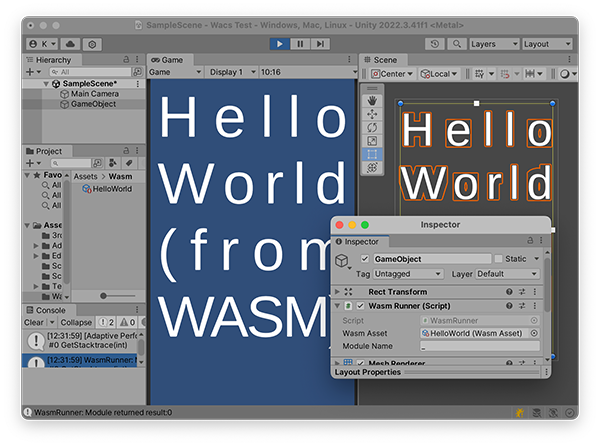

# WACS (WebAssembly CSharp Toolchain)

**Project status**
&nbsp;
&nbsp;
&nbsp;[](LICENSE)
&nbsp;[](https://www.nuget.org/packages/WACS)

## Overview

**WACS** is a pure C# WebAssembly Interpreter for running WASM modules in .NET environments, including Godot and AOT environments like Unity's IL2CPP.

WACS supports the latest standardized webassembly feature extensions including **Garbage Collection** and **JSPI**-like async execution. 



## Table of Contents

- [Packages](#packages)
- [Features](#features)
- [WebAssembly Feature Extensions](#webassembly-feature-extensions)
- [Component Model & WASI Preview 2](#component-model--wasi-preview-2)
- [Repository Layout](#repository-layout)
- [Getting Started](#getting-started)
- [Installation](#installation)
- [Usage](#usage)
- [Integration with Unity](#integration-with-unity)
- [Integration with Godot](#integration-with-godot)
- [Interop Bindings](#interop-bindings)
- [Customization](#customization)
- [Performance](#performance)
- [WebAssembly Text Format (WAT / WAST)](#webassembly-text-format-wat--wast)
- [License](#license)

## Packages

Versions auto-update from NuGet. See the [CHANGELOG](CHANGELOG.md) for release notes.

> **Renaming notice (0.11.0):** the `WACS.WASIp1` package has been renamed to `WACS.WASI.Preview1` to make room for `WACS.WASI.Preview2` / `.Preview3` under one prefix. The old id still restores (it's now a metapackage) but emits a build-time warning. See [docs/MIGRATION_WASIp1_to_WASI.md](docs/MIGRATION_WASIp1_to_WASI.md) for the one-shot sed.

> **CLI:** install the unified `wacs` global tool with
> `dotnet tool install -g WACS.Cli`. The legacy `WACS.Transpiler`
> (`wasm-transpile`) is deprecated and superseded — see
> [`Wacs.Console/Wacs.Console/README.md`](Wacs.Console/Wacs.Console/README.md) for the
> verb-based subcommand reference.

| Package | Version | Notes |
|---|---|---|
| [`WACS`](https://www.nuget.org/packages/WACS) | [](https://www.nuget.org/packages/WACS) | Core interpreter runtime |
| [`WACS.Cli`](https://www.nuget.org/packages/WACS.Cli) | [](https://www.nuget.org/packages/WACS.Cli) | Unified `wacs` global CLI (`run` / `build` / `aot` / `inspect` / `bindgen`) |
| [`WACS.Transpiler.Lib`](https://www.nuget.org/packages/WACS.Transpiler.Lib) | [](https://www.nuget.org/packages/WACS.Transpiler.Lib) | AOT transpiler: WASM → .NET IL, JIT or NativeAOT |
| [`WACS.ComponentModel`](https://www.nuget.org/packages/WACS.ComponentModel) | [](https://www.nuget.org/packages/WACS.ComponentModel) | Component runtime, canonical-ABI lift/lower, `ComponentBridge` |
| [`WACS.ComponentModel.Bindgen.Lib`](https://www.nuget.org/packages/WACS.ComponentModel.Bindgen.Lib) | [](https://www.nuget.org/packages/WACS.ComponentModel.Bindgen.Lib) | Programmatic forward / reverse bindgen (used by `wacs bindgen`) |
| [`WACS.HostBindings.Abstractions`](https://www.nuget.org/packages/WACS.HostBindings.Abstractions) | [](https://www.nuget.org/packages/WACS.HostBindings.Abstractions) | `[WacsImport]` attribute surface for typed host bindings |
| [`WACS.HostBindings.SourceGen`](https://www.nuget.org/packages/WACS.HostBindings.SourceGen) | [](https://www.nuget.org/packages/WACS.HostBindings.SourceGen) | Source generator emitting `IImports` adapters from `[WacsImport]` |
| [`WACS.WASI.Preview1`](https://www.nuget.org/packages/WACS.WASI.Preview1) | [](https://www.nuget.org/packages/WACS.WASI.Preview1) | `wasi_snapshot_preview1` host implementation |
| [`WACS.WASI.Preview2`](https://www.nuget.org/packages/WACS.WASI.Preview2) | [](https://www.nuget.org/packages/WACS.WASI.Preview2) | Typed host impls for every WASI 0.2.3 subsystem + `IBindable` composite |
| [`WACS.WASI.Preview2.DependencyInjection`](https://www.nuget.org/packages/WACS.WASI.Preview2.DependencyInjection) | [](https://www.nuget.org/packages/WACS.WASI.Preview2.DependencyInjection) | One-call DI registration of the WASI Preview 2 bundle |
| [`WACS.WASI.Threads`](https://www.nuget.org/packages/WACS.WASI.Threads) | [](https://www.nuget.org/packages/WACS.WASI.Threads) | `wasi:thread-spawn` host adapter |
| [`WACS.WASI.NN`](https://www.nuget.org/packages/WACS.WASI.NN) | [](https://www.nuget.org/packages/WACS.WASI.NN) | wasi-nn host bindings (WIT + WITX), backend-agnostic core |
| [`WACS.WASI.NN.DependencyInjection`](https://www.nuget.org/packages/WACS.WASI.NN.DependencyInjection) | [](https://www.nuget.org/packages/WACS.WASI.NN.DependencyInjection) | DI scope + `WasiNNBundle` for the transpiler's direct-link emit |
| [`WACS.WASI.NN.OnnxRuntime`](https://www.nuget.org/packages/WACS.WASI.NN.OnnxRuntime) | [](https://www.nuget.org/packages/WACS.WASI.NN.OnnxRuntime) | wasi-nn ONNX backend (Microsoft.ML.OnnxRuntime, EP-selectable) |
| [`WACS.WASI.NN.OnnxRuntimeGenAI`](https://www.nuget.org/packages/WACS.WASI.NN.OnnxRuntimeGenAI) | [](https://www.nuget.org/packages/WACS.WASI.NN.OnnxRuntimeGenAI) | wasi-nn generative-LLM backend (Gemma / Llama / Qwen / Phi) |
| [`WACS.WASI.NN.LlamaSharp`](https://www.nuget.org/packages/WACS.WASI.NN.LlamaSharp) | [](https://www.nuget.org/packages/WACS.WASI.NN.LlamaSharp) | wasi-nn GGUF / llama.cpp backend (Metal on Apple Silicon) |
| [`WACS.WASI.NN.MLNet`](https://www.nuget.org/packages/WACS.WASI.NN.MLNet) | [](https://www.nuget.org/packages/WACS.WASI.NN.MLNet) | wasi-nn ML.NET-flavored ONNX backend |
| [`WACS.WASI.NN.TorchSharp`](https://www.nuget.org/packages/WACS.WASI.NN.TorchSharp) | [](https://www.nuget.org/packages/WACS.WASI.NN.TorchSharp) | wasi-nn TorchScript backend (PyTorch ecosystem) |

## Features

- **Unity Compatibility**: Compatible with **Unity 2021.3+** including AOT/IL2CPP modes for iOS.
- **Godot Compatibility**: Compatible with **Godot Engine - [.NET](https://docs.godotengine.org/en/stable/tutorials/scripting/c_sharp/c_sharp_basics.html)**. 
- **Pure C# Implementation**: Written in C# 9.0/.NET Standard 2.1. (No `unsafe` keyword blocks, no raw pointer arithmetic — see [notes on `System.Runtime.CompilerServices.Unsafe` in the switch dispatcher](#running-wacsconsole).)
- **No Complex Dependencies**: Uses [FluentValidation](https://github.com/FluentValidation/FluentValidation) and [Microsoft.Extensions.ObjectPool](https://www.nuget.org/packages/Microsoft.Extensions.ObjectPool) as its only dependencies.
- **WebAssembly 3.0 Spec Compliance**: Passes the [WebAssembly 3.0](https://webassembly.github.io/spec/core/_download/WebAssembly.pdf) spec [test suite](https://github.com/WebAssembly/spec/tree/wasm-3.0).
- **First-class WAT / WAST**: Pure-C# reader and writer for the WebAssembly text format. The `wacs` CLI takes `.wat` directly; the spec `.wast` suite parses natively with no external `wast2json` / wabt dependency.
- **Magical Interop**: Host bindings are validated with reflection, no boilerplate code required.
- **Async Tasks**: [JSPI](https://github.com/WebAssembly/js-promise-integration)-like non-blocking calls for async functions.
- **WASI:** WACS.WASI.Preview1 provides a [wasi\_snapshot\_preview1](https://github.com/WebAssembly/WASI/blob/main/legacy/preview1/docs.md) implementation.
- **Component Model & WASI Preview 2:** Full canonical-ABI lift/lower with WIT ↔ C# bindgen (forward and reverse); `Wacs.WASI.Preview2` ships default host implementations for every WASI 0.2.3 subsystem (`cli` / `clocks` / `filesystem` / `http` / `io` / `random` / `sockets`).

**WACS is for _mobile games_**. 

Because WebAssembly is memory-safe and can be ahead-of-time validated, WACS makes it possible to build safe, verifiable
UGC, DLC, or plugin systems that include executable logic.

## WebAssembly Feature Extensions
WACS is based on the [WebAssembly Core 3 spec](https://webassembly.github.io/spec/core/_download/WebAssembly.pdf) and passes the associated [test suite](https://github.com/WebAssembly/spec/tree/wasm-3.0).

Support for all standardized extensions is listed below.

Harnessed results from [wasm-feature-detect](https://github.com/GoogleChromeLabs/wasm-feature-detect) as compares to [other runtimes](https://webassembly.org/features/):

|Proposal |Features|    |
|------|-------|----|
|**Phase 5 – Standardized**|
|[Branch Hinting](https://github.com/WebAssembly/branch-hinting)||<span title="metadata.code.branch_hint custom section parsed; transpiler reorders `if`/`else` arms based on hints">✅</span>|
|[Bulk memory operations](https://github.com/webassembly/bulk-memory-operations)||✅|
|[Custom Annotation Syntax in the Text Format](https://github.com/WebAssembly/annotations)||✅|
|[Exception handling](https://github.com/WebAssembly/exception-handling)|exceptions|✅|
|[Extended Constant Expressions](https://github.com/WebAssembly/extended-const)|extended_const|✅|
|[Fixed-width SIMD](https://github.com/webassembly/simd)||✅|
|[Garbage collection](https://github.com/WebAssembly/gc)|gc|✅|
|[Import/Export of Mutable Globals](https://github.com/WebAssembly/mutable-global)||✅|
|[JavaScript BigInt to WebAssembly i64 integration](https://github.com/WebAssembly/JS-BigInt-integration)||<span title="Browser idiom, but conceptually supported">✳️</span>|
|[JS String Builtins](https://github.com/WebAssembly/js-string-builtins)||<span title="Browser idiom, but conceptually supported">✳️</span>|
|[Memory64](https://github.com/WebAssembly/memory64)|memory64|✅|
|[Multiple memories](https://github.com/WebAssembly/multi-memory)|multi-memory|✅|
|[Multi-value](https://github.com/WebAssembly/multi-value)|multi_value|✅|
|[Non-trapping float-to-int conversions](https://github.com/WebAssembly/nontrapping-float-to-int-conversions)||✅|
|[Reference Types](https://github.com/WebAssembly/reference-types)||✅|
|[Relaxed SIMD](https://github.com/webassembly/relaxed-simd)|relaxed_simd|✅|
|[Sign-extension operators](https://github.com/WebAssembly/sign-extension-ops)||✅|
|[Tail call](https://github.com/webassembly/tail-call)|tail_call|✅|
|[Typed Function References](https://github.com/WebAssembly/function-references)|function-references|✅|
|**Phase 4 – Standardize**|
|[JS Promise Integration](https://github.com/WebAssembly/js-promise-integration)|jspi|<span title="Browser idiom, but conceptually supported">✳️</span>|
|[Threads](https://github.com/webassembly/threads)|threads|✅|
|[Web Content Security Policy](https://github.com/WebAssembly/content-security-policy)||<span title="Browser idioms, not directly supported">🌐</span>|

Legend: ✅ supported · ❌ not yet · ✳️ [conceptually supported (browser idiom)](./docs/BROWSER_IDIOMS.md) · 🌐 browser-only / N/A for non-web hosts

###### Grouping follows [webassembly.org/features](https://webassembly.org/features/): Phase 5 is the combined standardized set (including finished proposals merged to the core spec) and Phase 4 is the active standardize queue. Phase assignments cross-checked against [WebAssembly/proposals@1584fdf](https://github.com/WebAssembly/proposals/commit/1584fdf) (2026-03-24) and [WebAssembly/proposals/finished-proposals.md](https://github.com/WebAssembly/proposals/blob/main/finished-proposals.md). Browser-idiom ✳️/🌐 results harnessed from [wasm-feature-detect](https://github.com/GoogleChromeLabs/wasm-feature-detect) via the [Feature.Detect](./Feature.Detect) test harness.

## Component Model & WASI Preview 2

WACS implements the [WebAssembly Component Model](https://github.com/WebAssembly/component-model) on the same parse / validate / link pipeline used for core modules. The `WACS.ComponentModel` package handles canonical-ABI lift/lower, WIT type emission, and cross-engine composition; `WACS.WASI.Preview2` ships default host implementations for every WASI 0.2.3 subsystem.

### What's supported

- **Component runtime** — instantiation, resource handles (`own` / `borrow`), variants, options, results, lists, records / tuples / flags. Both interpreted and AOT-transpiled execution.
- **Canonical ABI** — full lift/lower including aggregate returns through retArea, UTF-8 / UTF-16 / Latin-1 string encodings, recursive variant arms, and instance-method resource calls.
- **WIT ↔ C# bindgen** — forward (`.wit` → typed C# interfaces tagged with `[WitSource]`) and reverse (transpiled `.dll` → regenerated WIT + bindings) directions, available as `wacs bindgen` or programmatically via `WACS.ComponentModel.Bindgen.Lib`.
- **Direct-linked imports** — under `--engine transpiler`, Preview 2 calls bypass the delegate dispatch table and inline straight into the generated CLR methods.
- **Cross-engine composition** — `ComponentBridge.AsTypedInterface<T>` / `AsHostBundle` adapters let interpreted and transpiled components compose against the same typed contract.
- **Contract validation** — `Linker.Validate(WitContract.FromAssembly(...))` cross-checks bound host implementations against the WIT contract embedded in the bindings assembly, catching drift at link time.

### Quick start

```bash
# Run a component with WASI Preview 2 + wasi-nn (ONNX) wired
wacs run my.component.wasm --wasip2 --wasi-nn -d ./models::/models

# Generate C# bindings from a WIT package
wacs bindgen wit/cli/world.wit -o ./gen

# Reverse: regenerate bindings from a transpiled .dll
wacs bindgen app.dll -o ./regen
```

The CLI shorthands (`--wasip2`, `--wasi-nn`, `--wasi-threads`) load
the matching host packages AND their DependencyInjection siblings —
both are needed because typed `[WitSource]` interfaces and the
SourceGen-shape impl classes the transpiler instantiates live in
sibling assemblies.

### Runtime requirements at a glance

| Capability | Packages on load path |
|---|---|
| `--wasip2` | `WACS.WASI.Preview2` + `WACS.WASI.Preview2.DependencyInjection` |
| `--wasi-nn` | adds `WACS.WASI.NN` + `WACS.WASI.NN.DependencyInjection` + `WACS.WASI.NN.OnnxRuntime` |
| `--wasi-threads` | adds `WACS.WASI.Threads` |
| Custom imports | `--bind <Asm>` (any `IBindable`) |

When a component imports multiple WASI packages, `HostPackageResolver`
auto-discovers the **composite bundle** (`WasiPreview2NNBundle`) that
forwards every `[WitSource]` interface through one CLR object, plus
the single `WasiPreview2Resources` registry so resource handles
share one namespace across all subsystems.

See [`docs/COMPONENT_CHAINING.md`](docs/COMPONENT_CHAINING.md) for the
full chaining model, the AppDomain-fallback contract for
dynamically loaded DI siblings, and how to add a new WASI subsystem
to the composite.

### Embedding — one-shot scope

For a programmatic embedder doing the same as `wacs run`,
`WasiPreview2RuntimeScope` wraps the DI graph + composite-bundle
discovery + Linker prebind into one disposable:

```csharp
using Wacs.Core.Runtime;
using Wacs.WASI.Preview2.DependencyInjection;

var runtime = new WasmRuntime();
using var wasi = new WasiPreview2RuntimeScope(
    runtime,
    preopens: new[] { ("./models", "/models") });

// wasi.Bundle      → composite hostBundle (Preview2 + WASI.NN
//                     when WASI.NN.DependencyInjection is loadable)
// wasi.Resources   → single resource registry shared across subsystems
// wasi.Runtime     → runtime, with every wasi:* binding wired

// Now instantiate the component — see docs/COMPONENT_CHAINING.md
// for the full lift example.
```

For per-subsystem `IServiceCollection` wiring (selective overrides,
ASP.NET-scoped execution, custom impls), see
[`Wacs.WASI/Wacs.WASI.Preview2/Wacs.WASI.Preview2/README.md`](Wacs.WASI/Wacs.WASI.Preview2/Wacs.WASI.Preview2/README.md).

For the interpreter-only embedding (one-line runtime extensions
without DI):

```csharp
using Wacs.Core.Runtime;
using Wacs.WASI.Preview2;
using Wacs.WASI.NN;
using Wacs.WASI.NN.OnnxRuntime;
using Wacs.WASI.NN.Types;

var runtime = new WasmRuntime();
runtime.UseWasiPreview2(b => b.EnableSockets());
runtime.UseWasiNN(b => b.AddBackend(GraphEncoding.ONNX, new OnnxBackend()));

// Or auto-discover any [WasiHostPackage]-tagged assembly already loaded:
runtime.AutoDiscoverHostPackages();
```

### Packages

| Package | Purpose |
|---|---|
| [`WACS.ComponentModel`](https://www.nuget.org/packages/WACS.ComponentModel) | Component runtime, canonical-ABI lift/lower, `ComponentBridge` cross-engine adapter |
| [`WACS.ComponentModel.Bindgen.Lib`](https://www.nuget.org/packages/WACS.ComponentModel.Bindgen.Lib) | Programmatic forward / reverse bindgen (used by `wacs bindgen`) |
| [`WACS.WASI.Preview2`](https://www.nuget.org/packages/WACS.WASI.Preview2) | Typed host impls + `WasiPreview2Host : IBindable` composite + `runtime.UseWasiPreview2(...)` |
| [`WACS.WASI.Preview2.DependencyInjection`](https://www.nuget.org/packages/WACS.WASI.Preview2.DependencyInjection) | One-call DI registration of the bundle |
| [`WACS.WASI.NN`](https://www.nuget.org/packages/WACS.WASI.NN) | wasi-nn host bindings (WIT + WITX) + `WasiNNHost : IBindable` + source-gen `[WitSource]` interfaces |
| [`WACS.WASI.NN.DependencyInjection`](https://www.nuget.org/packages/WACS.WASI.NN.DependencyInjection) | `WasiNNBundle`, `WasiPreview2NNBundle` composite, concrete resource impls (`Tensor`, `Graph`, `GraphExecutionContext`, `Error`) |
| [`WACS.WASI.NN.{OnnxRuntime,MLNet,LlamaSharp}`](https://www.nuget.org/packages/WACS.WASI.NN.OnnxRuntime) | Backend implementations + parameterless `IBindable` adapters (`WasiNNOnnxBindable`, `WasiNNMLNetBindable`, `WasiNNLlamaSharpBindable`) for `--bind` |
| [`WACS.WASI.Threads`](https://www.nuget.org/packages/WACS.WASI.Threads) | `wasi:thread-spawn` host adapter + `runtime.UseWasiThreads()` |

## WASI Preview 1

`WACS.WASI.Preview1` implements all 47 `wasi_snapshot_preview1` host
functions — args / environ, two-clock time, the full file-descriptor
and path surface (read / write / pread / pwrite / readdir / seek /
sync / allocate / fdstat / filestat / advise / renumber / link /
symlink / unlink / rename / create_directory / remove_directory /
readlink), poll_oneoff, proc_exit / proc_raise / sched_yield,
random_get, and the full sock_* surface (accept / recv / send /
shutdown). Network sockets are gated behind a default-off
`WasiConfiguration.AllowNetworkSockets` flag plus the requirement that
the embedder hand WACS pre-bound, pre-listening sockets via
`PreopenedSockets` — two layers of explicit consent before any guest
can do network IO.

Conformance is verified continuously against the official
[WebAssembly/wasi-testsuite](https://github.com/WebAssembly/wasi-testsuite)
fixtures (Rust + C + AssemblyScript). The runner lives at
`Wacs.WASI/Wacs.WASI.Preview1/Wacs.WASI.Preview1.Test/` and runs as part of `dotnet test` in CI;
the test project's `skip.json` documents which conformance fixtures
are deliberately not yet asserting (each entry carries a reason).

> The package was renamed from `WACS.WASIp1` in 0.11.0. The old id
> still restores via a metapackage shim (with a build-time warning).
> See [docs/MIGRATION_WASIp1_to_WASI.md](docs/MIGRATION_WASIp1_to_WASI.md).

## Repository Layout

Source projects are grouped into family folders by functional pillar.
Each folder has its own README explaining the projects underneath.

| Family | Pillar |
|---|---|
| **[Wacs.Core/](Wacs.Core/README.md)** | The interpreter — `WasmRuntime`, parsers, polymorphic + switch runtimes, full op set. Source generator for the switch dispatcher lives alongside. |
| **[Wacs.Transpiler/](Wacs.Transpiler/README.md)** | Ahead-of-time wasm → .NET IL transpiler. `WACS.Transpiler.Lib` is the programmatic API; the deprecated `wasm-transpile` CLI sits here too. |
| **[Wacs.Console/](Wacs.Console/README.md)** | The unified `wacs` CLI (NuGet `WACS.Cli`) — `wacs run / build / aot / inspect / bindgen`, with `--wasi` / `--wasip2` baking in host packages. |
| **[Wacs.ComponentModel/](Wacs.ComponentModel/README.md)** | Component-model runtime + WIT parser + canonical-ABI engine + `wit-bindgen-wacs` (forward & reverse C# bindgen). |
| **[Wacs.HostBindings/](Wacs.HostBindings/README.md)** | Attribute contract (`[WacsImport]`, `WacsHostMemory`) + Roslyn source generator that emits dispatch glue for the transpiler's NativeAOT path. |
| **[Wacs.WASI/](Wacs.WASI/README.md)** | All WASI host implementations, organized by sub-family — `Wacs.WASI.Preview1/`, `Wacs.WASI.Preview2/` (WASI 0.2.3), `Wacs.WASI.NN/` (wasi-nn + 3 backends), `Wacs.WASI.Threads/`. |
| **[Wacs.Bench/](Wacs.Bench/README.md)** | Developer-only perf harnesses — bench, AOT bench, opcode profiler. Not packaged. |

Top-level non-`Wacs.*` projects:

| Folder | Role |
|---|---|
| **[Spec.Test/](Spec.Test/)** | The wasm spec wast test runner + fixtures (`Spec.Test/spec/` git submodule, `Spec.Test/wasi/` for the wasi-testsuite submodule). The `Spec.Test/Data/` subfolder holds the harness library types other test projects reference. |
| **[Feature.Detect/](Feature.Detect/)** | Generates the wasm-feature-detect probe table that the [WebAssembly Feature Extensions](#webassembly-feature-extensions) section above is sourced from. |

## Getting Started

### Installation

The easiest way to use WACS is to add the package from NuGet

```bash
dotnet add package WACS
dotnet add package WACS.WASI.Preview1
````

### `wacs` CLI

`WACS.Cli` is the unified WebAssembly toolchain — `wacs` runs,
compiles, and inspects WASM modules and components, backed by the
WACS interpreter and the AOT transpiler library. Installs as a
[dotnet global tool](https://learn.microsoft.com/en-us/dotnet/core/tools/global-tools):

```bash
dotnet tool install -g WACS.Cli

# Run (interpreter, default)
wacs run module.wasm

# Build to a .NET assembly
wacs build module.wasm -o module.dll

# Build directly to a self-contained NativeAOT native binary
wacs aot module.wasm -o module
# (transpile + scaffold + dotnet publish -p:PublishAot=true,
# all in one shot. Output is a real native exe — no .NET runtime
# required to run.)
```

For WASI preview1 modules (CoreMark, anything built against `wasi-libc`):

```bash
wacs run coremark.wasm --wasi --engine transpiler
# AOT-transpile in-process, then run through CLR-native dispatch
# with WASI imports proxied through the interpreter (mixed-mode)

# Or precompile then run through `dotnet`:
wacs build coremark.wasm --wasi --emit-main -o coremark.dll

# Or go all the way to a NativeAOT binary:
wacs aot coremark.wasm --wasi -o coremark
```

`--wasi` binds `WACS.WASI.Preview1`, forwards all `wasi_snapshot_preview1`
imports, shares memory with the runtime, and invokes the entry-point
export. For component-mode WASI Preview 2 (direct-linked, no
delegate hop), use `--wasip2`:

```bash
wacs run app.component.wasm --wasip2
wacs aot app.component.wasm --wasip2 -o app   # all the way to NativeAOT
```

Command components don't need `--call` — `wacs run --wasip2`
auto-dispatches the canonical `wasi:cli/run@<version>#run` export,
matching `wasmtime` / `jco` / `wasmer`. Reactor modules
(`_initialize` without `_start`) get `_initialize` invoked before
any explicit `--call`. `wasi:cli/exit.exit(N)` propagates to the
host process exit code.

For wasi-nn (ONNX inference) and wasi-threads, the matching
shorthands wire the bundled host packages:

```bash
wacs run my.component.wasm --wasip2 --wasi-nn -d ./models
wacs run my.threaded.wasm --wasi-threads
```

For custom host imports (`env.sayc`, game bindings, etc.), use
`--bind <asm>` to load any `IBindable` host library. `--bind`
accepts file paths (`Assembly.LoadFrom`) or assembly names
(`Assembly.Load`); honored on every dispatch path including the
component paths. For programmatic embedding, reference
[`WACS.Transpiler.Lib`](https://www.nuget.org/packages/WACS.Transpiler.Lib)
and use `BindHostFunction` + the built-in `TranspiledModuleLoader`
or a custom `ImportDispatcher` proxy.

Want to know which host packages a component needs? `wacs inspect
<comp.wasm> --imports` enumerates the component-level imports
(instance + name + version) so you can predict what to wire before
running.

See [`Wacs.Console/Wacs.Console/README.md`](Wacs.Console/Wacs.Console/README.md) for the full
verb reference (`run` / `build` / `inspect`), the direct-run
shortcut, the engine-choice trade-off, and concrete migrations
from the deprecated `wasm-transpile`.

### From source

If you prefer to build WACS from source, you can clone the repo and build it with the .NET SDK:

```bash
git clone https://github.com/kelnishi/WACS.git
cd WACS
dotnet build
```

## Usage

Basic usage example, how to load and run a WebAssembly module:

```csharp
using System;
using System.IO;
using Wacs.Core;
using Wacs.Core.Runtime;

//Create a runtime
var runtime = new WasmRuntime();

//Bind a host function
//  This can be any regular C# delegate.
//  The type here will be validated against module imports.
runtime.BindHostFunction<Action<char>>(("env", "sayc"), c =>
{
    System.Console.Write(c);
});

//Load a module from a binary file
using var fileStream = new FileStream("HelloWorld.wasm", FileMode.Open);
var module = BinaryModuleParser.ParseWasm(fileStream);

//Instantiate the module
var modInst = runtime.InstantiateModule(module);

//Register the module to add its exported functions to the export table
runtime.RegisterModule("hello", modInst);

//Get the module's exported function
if (runtime.TryGetExportedFunction(("hello", "main"), out var mainAddr))
{
    //For wasm functions you can expect return types as Wacs.Core.Runtime.Value
    //  Value has implicit conversion to many useful primitive types
    var mainInvoker = runtime.CreateInvokerFunc<Value>(mainAddr);
    
    //Call the wasm function and get the result
    //  Implicit conversion from Value to int
    int result = mainInvoker();
    
    System.Console.Error.WriteLine($"hello.main() => {result}");
}
```

## Integration with Unity

### With Unity Package Manager
1. Window>Package Manager
2. Click + Add package from git URL...
3. Enter the package repo URL:
 ```text
 git@github.com:kelnishi/WACS-Unity.git
 ```
4. Click Add

This will put the DLLs into your project. 
Import the WasmRunner sample to get started.

### Manually
To manually add WACS to a Unity project, you'll need to add the following DLLs to your Assets directory:
- Wacs.Core.dll
- FluentValidation.dll
- Microsoft.Extensions.ObjectPool.dll

Set **Player Settings>Other Settings>Api Compatibility Level** to **.NET Standard 2.1**.

## Integration with Godot
WACS is compatible with **[Godot Engine -.NET](https://docs.godotengine.org/en/stable/tutorials/scripting/c_sharp/c_sharp_basics.html)** in C# projects.
- Add WACS via [NuGet](https://www.nuget.org/packages/WACS) with the commandline or your IDE's NuGet tool.
- See [sample/GodotSample.cs](https://github.com/kelnishi/WACS/tree/main/sample/GodotSample.cs) for loading wasm files.

## Interop Bindings

WACS simplifies host function bindings, allowing you to easily call .NET functions from WebAssembly modules.
This allows seamless communication between your host environment and WebAssembly without boilerplate code.
Similarly, calling into wasm code is done by generating a typed delegate.

Example from WASI Preview 1:

```csharp
//Alias your types for readability
using ptr = System.Int32;

//WACS can bit-convert types like Enums and explicit layout structs
[WasmType(nameof(ValType.I32))]
public enum ErrNo : ushort
{
    Success = 0,
    ...
}

//Supply the delegate definition when binding
//  ExecContext is an optional first parameter for Memory and Stack manipulation
runtime.BindHostFunction<Func<ExecContext,ptr,ptr,ErrNo>>(
   (module, "args_get"), ArgsGet);

// WASI Preview 1's args_get
public ErrNo ArgsGet(ExecContext ctx, ptr argvPtr, ptr argvBufPtr)
{
    var mem = ctx.DefaultMemory;
            
    foreach (string arg in _config.Arguments)
    {
        // Copy argument string to argvBufPtr.
        int strLen = mem.WriteUtf8String((uint)argvBufPtr, arg, true);
                
        // Write pointer to argument in argvPtr.
        mem.WriteInt32(argvPtr, argvBufPtr);

        // Update offsets.
        argvBufPtr += strLen;
        argvPtr += sizeof(ptr);
    }

    return ErrNo.Success;
}
```

## Customization

If you'd like to customize the wasm runtime environment, I recommend downloading the full source for examples.

The `Wacs.WASI.Preview1` implementation is a good starting point for how to set up your own library of bindings.
It also contains examples of more advanced usage like binding multiple return values and full operand stack access.

The `Spec.Test` project runs the wasm spec test suite. This also contains examples for binding other runtime environment
objects like Tables, Memories, and Variables.

Custom Instruction implementations can be patched in by replacing or inheriting from `SpecFactory`.

## Performance

WACS is a bytecode (wasm) interpreter running on a bytecode interpreted (or JIT'd) language (CIL/CLR). This is, as you can imagine,
*not a recipe for raw performance*. However, recognizing this dynamic allows us to make certain optimizations to achieve
performance closer to other languages in other VMs.

### The Spec-Defined Implementation
The Wasm Virtual Machine is a stack machine. This means that instructions produce operands, place them on the stack, and then other
instructions consume them by popping them from the stack. WACS uses a pre-allocated linear stack for more register-like performance.
However, even a virtualized stack is costly to manage as the CLR will still need to manage memory and objects at its boundaries.
To optimize further, we'll need to opportunistically use register-machine semantics by swapping out equivalent operations. 

### Link-time optimization
The design of the WASM VM includes block labelling for branch instructions and a heterogeneous operand/control stack.
WACS uses a split stack that separates operands and control. This enables us to make some key optimizations:
- Non-flushing branch jumps. We can leave operands on the stack if intermediate states don't interfere.
- Precomputed block labels. We can ditch the control frame's label stack entirely!
- Modern C# ObjectPools and ArrayPools minimize unavoidable allocation

### Super-Instruction Threading (interpreter)
Here's where we break WASM semantics and go off-road to claw back some performance.
A linear list of WASM instructions can be inverted into an expression tree. The WAT text format supports both the linear
and the tree structure; they are conceptually equivalent. We'll use this similarity by applying the transform to the binary AST.
Take for example, this sequence:
> i32.const 5   <- Pushes 5 onto the stack
> 
> i32.const 7   <- Pushes 7 onto the stack
> 
> i32.add       <- Pops 7, Pops 5, Pushes 12 onto the stack

For a sequence representing `5+7`, this is performing potentially 8+ function calls, multiple Value.ctors, memory bounds checks, etc.
All this, not even including the actual computation (+). Knowing this, we have an alternative.

**Expression Tree Rewriting**

```
       i32.add
     /         \
i32.const 5  i32.const 7
```
When enabled (`runtime.SuperInstruction = true`), WACS does a linear pass through the instruction sequences and rolls up interdependent instructions into directed acyclic graphs.
Instructions are replaced with functionally equivalent expression trees `InstAggregate`. The new aggregate instructions are *in-memory*
and are implemented with pre-built relational functions. Ultimately, these instructions are compiled by the dotnet build process into bytecode
to be run by the runtime. The rewriter lives in `Wacs.Core.Runtime.SuperInstruction` (`SuperInstructionRewriter.Rewrite`) with
the synthetic instructions in `Wacs.Core.Instructions.SuperInstruction`.

How does this differ from executing the wasm instructions linearly with the WACS VM?
- No OpStack manipulation
- Values are passed directly without casting or boxing
- The CLR's implementation can use hardware more effectively (use registers instead of heap memory)
- Avoids instruction fetching and dispatch

Throughput win is roughly 20–25% on compute-bound microbenchmarks (see the
[Running `wacs`](#running-wacs) section below for CoreMark numbers).
Gains are situational: linking instructions into a tree can't always be
determined across block boundaries, so WASM code heavy on function calls
or branches sees less benefit — the rewriter passes those sequences
through unaltered.

### Switch Runtime (source-generated dispatcher)

An alternative interpreter backed by a source-generated monolithic `switch`
over an annotated bytecode stream. Immediates are pre-decoded at instantiation
(no LEB128 at runtime), branch targets are resolved to absolute stream offsets,
and every reachable function is compiled eagerly when `UseSwitchRuntime` is
set before `InstantiateModule`. AOT-safe — no `Reflection.Emit`, no
`DynamicMethod`, build-time source generation only.

**Opt-in at the API level:**

```csharp
var runtime = new WasmRuntime();
runtime.UseSwitchRuntime = true;                                   // route wasm→wasm dispatch through the switch runtime
runtime.ExecContext.Attributes.UseSwitchSuperInstructions = true;  // (optional) run the bytecode-stream super-instruction fuser

var modInst = runtime.InstantiateModule(module);                   // must happen AFTER UseSwitchRuntime is set
```

See the [Running `wacs`](#running-wacs) section below for all CLI
combinations across the polymorphic, super-instruction, switch, and
AOT paths, plus benchmark numbers.

Architectural details live in
[`Wacs.Core/Wacs.Core/Compilation/SWITCH_RUNTIME.md`](Wacs.Core/Wacs.Core/Compilation/SWITCH_RUNTIME.md).
The polymorphic runtime remains the canonical path; the switch runtime is
a parallel back-end on top of the same parse/validate/link pipeline.

### AOT Transpiler (`WACS.Transpiler`)
Super-instruction threading squeezes more out of the interpreter, but each WASM instruction still goes through a dispatch
layer. The `WACS.Transpiler` package takes the next step: it *compiles* the module into a real .NET assembly at
ahead-of-time, producing native CLR methods the JIT can optimize like any other managed code.

**Architecture**

- **IL emission.** For every local WASM function, the transpiler walks the parsed instruction stream and emits CIL
  directly into a `TypeBuilder`, so the JIT sees ordinary static methods — no interpreter, no OpStack, no value boxing.
- **Typed CLR shapes.** Module exports/imports surface as generated C# interfaces with WASM-qualified names
  (`long FacSsa(long)`), and `ref`/GC types are emitted as native CLR classes with typed fields rather than boxed
  `Value[]` wrappers.
- **Dual SIMD paths.** `v128` ops have two implementations — a spec-compliant scalar reference path (`--simd scalar`,
  the default) and a `System.Runtime.Intrinsics`-backed path (`--simd intrinsics`). A third mode (`--simd interpreter`)
  falls back to the scalar SIMD in `Wacs.Core`.
- **Transpile-time validation.** A `CilValidator` verifies stack balance, typing, and branch targets *as IL is emitted*,
  so any invalid module trips at transpile time rather than as a runtime `InvalidProgramException`.
- **Mixed-mode execution.** Transpilation is opportunistic: any function the transpiler declines (e.g. very large bodies
  under `--max-fn-size`) falls back to the Wacs.Core interpreter for that function only, so the module still runs.
- **CLI + library.** The `WACS.Cli` NuGet package installs the
  `wacs` dotnet global tool — `wacs build` for one-shot `.wasm →
  .dll` compilation, `wacs run --engine transpiler` for in-process
  AOT execution. The programmatic surface ships separately as
  [`WACS.Transpiler.Lib`](https://www.nuget.org/packages/WACS.Transpiler.Lib)
  — reference it to drive transpilation and loading from inside a
  host. The library also includes `TranspiledModuleLoader` for
  seamless dynamic loading of saved `.dll`s without
  `Reflection.Emit`. See
  [`Wacs.Console/Wacs.Console/README.md`](Wacs.Console/Wacs.Console/README.md) for the full
  CLI verb reference. The legacy `WACS.Transpiler` /
  `wasm-transpile` package is deprecated in favor of `WACS.Cli` but
  remains installable for migration purposes.

The transpiler is spec-equivalent to the interpreter on the WebAssembly 3.0 test suite (473/473), verified on macOS ARM64 and Linux x64.

### Expected Runtime Performance

Measured CoreMark throughput on a MacBook Pro M3 Max, .NET 8. The
native baseline is the EEMBC CoreMark C source built with
`clang -O3` and run directly on the CPU (single-core, 600 000
iterations, three runs within 0.2% of each other). WACS numbers come
from running `Wacs.Console/Wacs.Console/Data/coremark.wasm` — the same C source,
compiled to WASM with `clang -O3` via emscripten — through each mode.

| Mode | CoreMark iter/s | % of native |
|---|---:|---:|
| `wacs run` (polymorphic interpreter, default) | 274 | 0.79% |
| `wacs run --super` | 337 | 0.98% |
| `wacs run --switch` | 358 | 1.04% |
| `wacs run --switch --super` | 385 | 1.12% |
| `wacs run --engine transpiler` (Reflection.Emit AOT) | 17 552 | **50.9%** |
| `wacs build` pre-compiled `.dll` loaded via `TranspiledModuleLoader` | 17 552 | **50.9%** |
| Native `clang -O3` (same C source, no wasm) | 34 488 | 100% |

Ballpark comparison to other WASM runtimes on the same workload (not
measured on this machine — pulled from published numbers; treat as
positioning, not apples-to-apples):

- **WACS AOT (`--engine transpiler`) ≈ WAMR "fast JIT" / Wasmer.**
  AOT-class wasm runtimes typically land at 50–70% of native C on
  CoreMark; WACS's 51% is in that band.
- **WACS interpreter modes (274–385 iter/s) are slower than Wasm3**
  (typically 4–6 k iter/s on M-series). Wasm3 is heavily tuned for
  CoreMark-like tight loops; WACS's interpreter prioritises Unity
  AOT compatibility and WASM 3.0 spec completeness over interpreter
  micro-benchmarks. Think "Python-for-WASM" speed rather than
  "Wasm3-class interpreter."
- **All five modes are C#-on-CLR**, so speedups over interpreted
  Python or IronPython for equivalent logic look larger than the
  CoreMark-vs-C ratios above would suggest.

**Choosing a mode:**

- **Can you JIT?** (Desktop, server, `dotnet run`, Godot Mono) —
  use `wacs run --engine transpiler`. It's ~60× the interpreter and
  within ~2× of native C speed.
- **AOT-only target?** (Unity IL2CPP, `PublishAot`, iOS, full-AOT
  Mono) — pre-compile the `.wasm → .dll` on a JIT host with
  [`wacs build`](Wacs.Console/Wacs.Console/README.md#wacs-build--transpile-to-dll),
  ship the `.dll`, load it at runtime with `WACS.Transpiler.Lib`'s
  `TranspiledModuleLoader`. Same AOT speed, no `Reflection.Emit`
  dependency at runtime.
- **Locked-down / policy-reviewed target, can't ship a pre-compiled
  `.dll`?** — use `wacs run --switch --super`. Build-time source-gen
  + `System.Runtime.CompilerServices.Unsafe` intrinsics only, no
  runtime codegen, no `unsafe` keyword blocks. ~1.4× over the
  polymorphic baseline.
- **Maximum conservatism?** — default polymorphic, or `wacs run
  --super` for a small safe boost. Pure managed, no source-gen, no
  `Unsafe` usage. Fine for cold-path scripting, UGC validation, or
  logic that doesn't dominate a frame budget — but don't put it in
  a hot inner loop.

### Cold-Start

The runtime numbers above are *steady-state*. The first invocation
also pays the .NET tier-1 JIT cost, and a transpiler embedding pays
its `Reflection.Emit` warm-up — together that's ~30–55 ms of cold
start out of the box on a tiny module. Two build-time switches knock
that down dramatically; pick the row that matches what your embedding
ships:

| tier | build flag | cold to first call (fib(100), 242-byte module) | trade-off |
|------|------------|---------------------------------:|-----------|
| **default** | plain `dotnet publish -c Release` | 35–55 ms | Smallest deploy artifact, every runtime works. JIT warmup dominates. |
| **better**  | `-p:PublishReadyToRun=true --self-contained` | 16–30 ms | Larger publish (~70 MB self-contained). All four runtimes still work. ~1.5–2.8× faster cold; the `--switch` interpreter sees the biggest win (45 → 16 ms) because R2R skips the giant prefix-split-switch tier-1 JIT. |
| **best (interpreter-only)** | `<PublishAot>true</PublishAot>` in csproj | **0.3–1.0 ms** | Single ~10 MB native binary, no JIT in the process. Excludes `transpiler` and `Wacs.ComponentModel` (both need runtime IL emission). `--switch` interpreter hits 319 µs cold. |
| **best (transpiler ok)** | `wacs build` then `TranspiledModuleLoader.Load` under R2R | **~1 ms** | Run the transpile once at build time and ship the `.dll`. Same R2R caveats, plus a one-time ~100 ms transpile cost off the runtime path. Steady-state matches the in-process transpiler. |

For the absolute cold-start floor — both startup *and* steady-state on
a single machine — there's a fifth path worth knowing about: link the
transpiled `.dll` statically into a NativeAOT-published consumer (501 µs
cold and ~100 ns per fib(100) call, in a 4.3 MB native binary). The
`wacs aot` verb automates the whole pipeline end-to-end today
(`wacs aot module.wasm -o module` → transpile → scaffold consumer
csproj → `dotnet publish -p:PublishAot=true` → copy native binary
out). Full breakdown, methodology, and the four-runtime ×
three-build-flag matrix in [`docs/COLDSTART.md`](docs/COLDSTART.md).

### Running `wacs`

`wacs` is the reference CLI — verb-based subcommand layout (`run`
/ `build` / `inspect`) with a direct-run shortcut so a bare
`wacs file.wasm` defaults to `run`. All examples assume the
`WACS.Cli` global tool is installed (`dotnet tool install -g
WACS.Cli`); the `dotnet run --project Wacs.Console -c Release --`
form works identically when running from a checkout.

```bash
# Default (polymorphic interpreter)
wacs run Wacs.Console/Wacs.Console/Data/coremark.wasm

# Polymorphic + super-instruction rewriter
wacs run --super Wacs.Console/Wacs.Console/Data/coremark.wasm

# Source-generated switch runtime
wacs run --switch Wacs.Console/Wacs.Console/Data/coremark.wasm

# Switch runtime + bytecode-stream super-instruction fuser
wacs run --switch --super Wacs.Console/Wacs.Console/Data/coremark.wasm

# AOT transpile in-process and run through the JITted code
wacs run --engine transpiler Wacs.Console/Wacs.Console/Data/coremark.wasm

# AOT with hardware SIMD intrinsics + persist the .dll for re-loading
wacs build --simd intrinsics -o out.dll Wacs.Console/Wacs.Console/Data/coremark.wasm
wacs run --engine transpiler --simd intrinsics Wacs.Console/Wacs.Console/Data/coremark.wasm
```

Invoking a specific export with arguments (applies across every mode):

```bash
wacs run --call fib Wacs.Bench/Wacs.Bench/fib.wasm -- 10
# Args after `--` are parsed per the function's wasm signature.
```

**Engine + interpreter cheatsheet:**

| Flag | Effect |
|---|---|
| *(default)* | Polymorphic virtual-dispatch interpreter. Baseline, canonical. |
| `--super` | Enable super-instruction fusion on whichever runtime ends up executing — the polymorphic block-level rewriter, and (when paired with `--switch`) the switch runtime's bytecode-stream fuser. |
| `--switch` | Source-generated monolithic-switch interpreter. Build-time code generation (Roslyn) + `System.Runtime.CompilerServices.Unsafe` intrinsics — see note below. |
| `--engine transpiler` | AOT transpile the **WASM module** to .NET IL and run through the generated code. Requires `Reflection.Emit` at runtime — see note below. |
| `--simd {scalar\|intrinsics\|interpreter}` | SIMD strategy for the transpiler engine. |
| `--no-tail-calls` | Drop the CIL `tail.` prefix on the transpiler engine (debugging only). |
| `--max-fn-size N` | Skip functions larger than N instructions in the transpile pass. |
| `--data-storage {compressed\|raw\|static}` | How data segments are embedded in the saved assembly (`build` verb). |

**Build verb (for shipping a pre-compiled `.dll`):**

```bash
# Single-file → .dll
wacs build app.wasm -o app.dll

# Multi-input ModuleLinker composition (siblings land at <basename>.dll)
wacs build a.wasm b.wasm -o b.dll

# Component with WASI Preview 2 + bake a runnable Main entry-point
wacs build app.component.wasm --wasip2 --emit-main \
    --entry-point greet -o app.dll
```

**Inspect verb (diagnostics + format conversion):**

```bash
wacs inspect module.wasm                # stats summary (default)
wacs inspect module.wasm --exports
wacs inspect module.wasm --imports
wacs inspect app.component.wasm         # component metadata

# WAT ↔ wasm round-trip:
wacs inspect module.wasm --dump-wat     # binary → WAT (stdout)
wacs inspect module.wat  --dump-wasm    # WAT → binary (stdout pipe)
wacs inspect module.wat  --dump-wasm --output-dir out/   # write out/module.wasm
```

Round-trips preserve function `$names` via the standard `name`
custom section and preserve WAT comments / `(@…)` annotations via
a `wacs.trivia` custom section. The `wacs.trivia` section is
WACS-specific (no spec) and ignored by other engines — strippable
when shipping a release binary.

**Spec-test bundle (`wast2json` verb):**

```bash
wacs wast2json forward.wast -o out/
# wrote out/forward.json (5 commands, 1 side-car modules)

wacs wast2json i32.wast -o out/
# wrote out/i32.json (460 commands, 86 side-car modules)
```

Mirrors `wabt`'s `wast2json` output shape — one `.json` file
listing commands plus one side-car `.wasm` per referenced module.
Consumable by any spec-test runner that reads the format,
including WACS's own `Spec.Test` (previously required `wast2json`
from the upstream `wabt` toolchain).

**Sampled CoreMark performance** (M3 Max, .NET 8, `Wacs.Console/Wacs.Console/Data/coremark.wasm`, default 6000 iterations; single run each):

| Mode | CoreMark (iter/s) | Relative |
|---|---:|---:|
| `wacs run` (polymorphic) | 274 | 1.00× |
| `wacs run --super` | 337 | 1.23× |
| `wacs run --switch` | 358 | 1.31× |
| `wacs run --switch --super` | 385 | 1.40× |
| `wacs run --engine transpiler` | **17 552** | **64×** |

The AOT path emits ordinary .NET methods that the CLR JIT optimizes as
native code, so the ~64× jump over the fastest interpreter mode is the
gap between "dispatch + pop/push per op" and "inline register arithmetic."
Expect similar ratios on any compute-bound workload; IO-bound / WASI-heavy
workloads see a smaller lift because WASI calls still bridge back to the
interpreter's host-function machinery.

> **"AOT" here means *ahead-of-time compilation of the WASM module*,
> not that the WACS runtime itself is AOT-safe.** `wacs run --engine
> transpiler` uses `System.Reflection.Emit` at runtime to synthesize
> a dynamic .NET assembly containing the transpiled module. That's
> incompatible with environments that disable dynamic code: **Unity
> IL2CPP, .NET Native AOT (`PublishAot=true`), iOS, Mono AOT-only
> builds,** etc. On those platforms use one of the three interpreter
> modes instead — all of them (including the source-generated
> `--switch` runtime) are fully AOT-compatible. If you need
> native-class speed in an IL2CPP target, pre-compile the `.wasm →
> .dll` on a JIT-capable host with
> [`wacs build`](Wacs.Console/Wacs.Console/README.md#wacs-build--transpile-to-dll)
> and ship the resulting assembly — the saved `.dll` runs without
> `Reflection.Emit` via `WACS.Transpiler.Lib`'s `TranspiledModuleLoader`.

> **`--switch` notes for restrictive targets.** The switch runtime
> is AOT-compatible — it uses **no runtime codegen** — but two
> implementation choices are worth flagging in case your environment
> forbids them:
>
> 1. **Build-time source generation (Roslyn).** The dispatcher method
>    is emitted by a Roslyn incremental source generator
>    (`Wacs.Compilation`) during the build of `Wacs.Core`. The shipped
>    `.dll` contains ordinary IL — there's no runtime Roslyn, no
>    dynamic code. If your build system runs Roslyn-based compilation
>    (the standard SDK path does), you're fine. If you consume WACS
>    as a pre-built NuGet package, the generation already happened
>    upstream and the binary is self-contained.
> 2. **`System.Runtime.CompilerServices.Unsafe` intrinsics.** The hot
>    loop uses `Unsafe.Add` / `Unsafe.ReadUnaligned` for inline array
>    indexing and LEB-free immediate reads — not `unsafe` pointer
>    blocks, not `fixed` statements. `System.Runtime.CompilerServices.
>    Unsafe` is part of the BCL on every .NET 8+ target (including
>    IL2CPP, PublishAot, iOS, trimmed assemblies). If your policy
>    reviews flag the keyword name, note that these are JIT/AOT
>    intrinsics, same family as `MemoryMarshal` — no raw pointer math,
>    no unverifiable IL.
>
> Both the polymorphic (default) and the polymorphic-super (`--super`)
> modes are pure managed code with no source-gen and no Unsafe usage —
> pick those if you need the most conservative surface. Expect ~25–40%
> lower throughput vs `--switch --super` on compute-bound workloads.

## WebAssembly Text Format (WAT / WAST)

WACS ships a pure-C# reader and writer for the WebAssembly text format.
No `wabt` / `wast2json` toolchain is required — `.wat` modules and
`.wast` spec scripts feed directly into the same `Module` and runtime
pipeline the binary parser uses.

### What's supported

- **`.wat` modules.** The full text grammar of WebAssembly 3.0,
  including every enabled proposal (GC structs / arrays / sub / rec
  groups, typed function references, tail-call, exception handling,
  SIMD, relaxed SIMD, multi-memory, memory64, threads/atomics,
  annotations). Abbreviations (inline imports/exports, implicit
  typeuse, folded instructions, anonymous blocks) are desugared into
  the same `Module` shape the binary parser produces.
- **`.wast` scripts.** `module`, `register`, `invoke`, `get`, and every
  `assert_*` form — including `(module binary …)` and
  `(module quote …)` — producing a `ScriptCommand[]` aligned with the
  existing spec-runner command shape.
- **Writer.** `TextModuleWriter.Write(module)` emits canonical,
  parser-friendly WAT that round-trips back through the text parser
  and produces a structurally equivalent `Module`.
- **AOT-safe.** No runtime `Reflection.Emit`. Reflection over
  `[OpCode("mnemonic")]` attributes happens once at static-ctor time
  to build the mnemonic→ByteCode lookup; everything else is plain
  managed code. `PublishAot=true` builds continue to pass.

### How it works

The text pipeline lives under `Wacs.Core.Text`:

- **`Lexer` / `Token` / `SExpr` / `SExprParser`** — a WAT-specific
  tokenizer (line / block comments, string escapes, annotations,
  quoted identifiers with full `\XX` / `\u{…}` UTF-8 decoding) feeding
  a lightweight s-expression tree. No WASM semantics at this layer.
- **`Mnemonics`** — a `FrozenDictionary<string, ByteCode>` built once
  by reflecting over the `[OpCode(...)]` attributes already present
  on every real opcode enum field (`OpCode`, `GcCode`, `ExtCode`,
  `SimdCode`, `AtomCode`). Parse and render share the same source of
  truth, so a mnemonic added in one direction is automatically
  visible in the other.
- **`TextModuleParser`** — two-pass section driver. Pass 1 pre-declares
  names and pre-populates the type section (including rec-group
  flattening for GC); pass 2 resolves `$name` references, synthesizes
  inline typeuses with rec-isolated dedup, and produces the same
  `Module` object the binary parser produces. Each instruction's
  text-specific immediate decoding lives in a per-class `ParseText`
  hook co-located with the binary `Parse` override — no parallel
  hierarchy of text decoders.
- **`TextScriptParser`** — `.wast` → `ScriptCommand[]`. Nested
  `(module …)` forms inside assertions are re-parsed through the
  same module parser; `(module binary …)` dispatches to the binary
  parser on an in-memory stream.
- **`TextModuleWriter`** — canonical round-trip emitter. Distinct from
  the existing `ModuleRenderer.RenderWatToStream` (debug/display
  variant with stack annotations and `(;id;)` comments), which is kept
  for inspection use.

### Using it

**CLI (`wacs`).** Pass a `.wat` path exactly like a `.wasm` path
— `wacs` auto-detects via the file extension:

```bash
# Run a text-format module through the polymorphic interpreter
wacs run path/to/module.wat

# Round-trip a binary module out as parser-friendly WAT
# (writes module.wat to the chosen --output-dir via TextModuleWriter)
wacs inspect path/to/module.wasm --dump-wat --output-dir .

# Re-run the emitted .wat through the interpreter to confirm round-trip
wacs run path/to/module.wat
```

Every back-end (`--super`, `--switch`, `--engine transpiler`, …)
works identically on `.wat` input since the parser produces the
same `Module` object the binary path does.

**Library.** One entry point, drops into any existing WACS flow:

```csharp
using Wacs.Core;
using Wacs.Core.Text;

using var fs = new FileStream("module.wat", FileMode.Open);
Module module = TextModuleParser.ParseWat(fs);

// Or from a string:
Module m2 = TextModuleParser.ParseWat(File.ReadAllText("module.wat"));

// Emit canonical, round-trip WAT:
string wat = TextModuleWriter.Write(module);
```

### Coverage

The `Wacs.Core.Test` xUnit project runs two gates across the full
WebAssembly 3.0 spec suite (`Spec.Test/spec/test/core/*.wast`):

- **`SpecWastSmokeTests`** — every `.wast` file in the spec suite
  parses without error. **120 / 120 files. No skipped files.** The
  `SkipList` is empty.
- **`SpecWastEquivalenceTests`** — every module embedded in a spec
  script parses through the text parser *and* through the binary
  parser (via `(module binary …)` or `wast2json`-produced `.wasm`
  sidecars), and the two `Module` objects are compared for structural
  equivalence (types, imports, functions, tables, memories, globals,
  exports, element segments, data segments, custom sections, plus
  instruction streams including preserved `try_table` shapes and
  rec-group layouts). **3457 / 3457 modules match.**

The text parser is held to the same wasm-3.0 bar as the runtime: GC,
typed function references, exception handling, tail-call, SIMD,
relaxed SIMD, multi-memory, memory64, threads/atomics, and
annotations all parse to structurally identical `Module` objects
regardless of which parser built them.

## Sponsorship & Collaboration

I built and maintain WACS as a solo developer. 

If you find it useful, please consider supporting me through sponsorship or work opportunities. 
Your support can help me continue improving WACS to make WebAssembly accessible for everyone. 

[Sponsor me](https://github.com/sponsors/kelnishi) or [connect with me on LinkedIn](https://www.linkedin.com/in/kelnishi) if you're interested in collaborating!

## License

WACS is distributed under the [Apache 2.0 License](./LICENSE). This permissive license allows you to use WACS freely in both open and closed source projects.

---

I would love for you to get involved and contribute to WACS! Whether it's bug fixes, new features, or improvements to documentation, your help can make WACS better for everyone.

**Star this project on GitHub if you find WACS helpful!** ⭐

